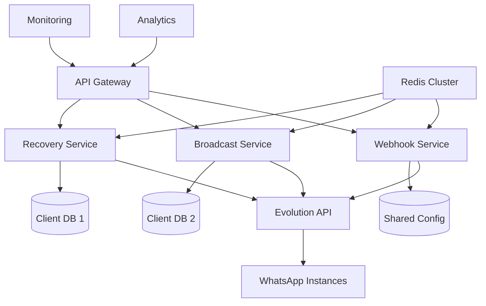

# 🚀 OracleWA SaaS - WhatsApp Automation Platform

[](https://github.com/tiagoelesbao/oraclewa)
[](./LICENSE)
[](https://github.com/tiagoelesbao/oraclewa/actions)
[](https://hub.docker.com/r/oraclewa/api)

> **Enterprise-grade WhatsApp automation platform with multi-tenant architecture, advanced anti-ban strategies, and unlimited scalability.**

## 🎯 Overview

OracleWA SaaS is a professional WhatsApp automation platform designed for businesses that need reliable, scalable, and compliant messaging solutions. Built with a modern multi-tenant architecture, it supports unlimited clients with complete isolation and enterprise-grade security.

### ✨ Key Features

- **🏗️ Multi-Tenant Architecture**: Complete isolation between clients
- **🔄 Automated Recovery**: Cart abandonment and expired order recovery
- **📢 Broadcast System**: Mass messaging with advanced anti-ban protection
- **🛡️ Anti-Ban Strategies**: Professional-grade protection using industry best practices
- **📊 Real-time Analytics**: Comprehensive metrics and reporting
- **🐳 Docker Ready**: Containerized deployment with orchestration support
- **⚡ Auto-scaling**: Handle thousands of messages per hour
- **🔒 Enterprise Security**: End-to-end encryption and audit trails

## 🏗️ Architecture



## 🚀 Quick Start

### Prerequisites

- Node.js 18+
- Evolution API instance
- Modern web browser

### Installation

```bash
# Clone the repository
git clone https://github.com/tiagoelesbao/oraclewa.git
cd oraclewa

# Start the system (automatic dependency installation)
./start.sh

# For production deployment
./start.sh production
```

### Unified Script Management

The system now uses a single, powerful script to manage all operations:

```bash
# Development mode (default) - with hot reload
./start.sh dev

# Production mode - optimized build
./start.sh production

# System management
./start.sh status    # Check service status
./start.sh health    # Run health checks
./start.sh stop      # Stop all services
./start.sh restart   # Restart services
./start.sh logs      # View real-time logs

# Advanced options
./start.sh production --build    # Force rebuild
./start.sh dev --no-deps        # Skip dependency check
./start.sh help                 # Show all options
```

### Access Points

Once started, access your system at:
- **Dashboard**: http://localhost:3001
- **API**: http://localhost:3000
- **Health Check**: http://localhost:3000/health

### Configuration

1. **Evolution API**: Configure your Evolution API instances
2. **Database**: Set up PostgreSQL with proper schemas
3. **Redis**: Configure Redis for caching and queues
4. **Webhooks**: Set up webhook endpoints for your clients
5. **Anti-ban**: Configure strategies based on your use case

## 📚 Documentation

### 🏆 **DOCUMENTOS PRINCIPAIS**
- 🎯 **[docs/INDICE_DOCUMENTACAO.md](./docs/INDICE_DOCUMENTACAO.md)** - **NAVEGAÇÃO COMPLETA** por perfil
- 🏆 **[docs/README_SISTEMA_COMPLETO.md](./docs/README_SISTEMA_COMPLETO.md)** - **DOCUMENTO MASTER** - Visão 360°

### 📖 **GUIAS POR CATEGORIA**
- 🔧 **[docs/GUIA_OPERACIONAL.md](./docs/GUIA_OPERACIONAL.md)** - Como usar sistema completo
- 📡 **[docs/GUIA_COMPLETO_BROADCAST.md](./docs/GUIA_COMPLETO_BROADCAST.md)** - Sistema broadcast massa
- 🚨 **[docs/TROUBLESHOOTING.md](./docs/TROUBLESHOOTING.md)** - Solução todos problemas  
- 🏗️ **[docs/architecture/ARQUITETURA_MULTI_TENANT.md](./docs/architecture/ARQUITETURA_MULTI_TENANT.md)** - Arquitetura v3.0
- 📈 **[docs/PLANEJAMENTO_ESTRATEGICO.md](./docs/PLANEJAMENTO_ESTRATEGICO.md)** - Roadmap futuro
- 📜 **[docs/HISTORICO.md](./docs/HISTORICO.md)** - Changelog completo

## 🎛️ Client Management

### Adding New Client

```bash
# Add new client with all services
./scripts/client-management/add-client.sh newclient "New Client Corp" all

# Add client with only recovery service
./scripts/client-management/add-client.sh recovery-only "Recovery Only LLC" recovery

# Add client with only broadcast service
./scripts/client-management/add-client.sh broadcast-only "Broadcast Corp" broadcast
```

### Client Configuration

Each client has isolated configuration:

```yaml
# clients/myclient/config.yml
client:
  id: myclient
  name: "My Company Ltd"
  services: ["recovery", "broadcast"]
  
recovery:
  enabled: true
  instances: ["client1-recovery"]
  limits:
    daily: 500
    hourly: 50

broadcast:
  enabled: true
  isolated: true
  instances: ["client1-broadcast-1", "client1-broadcast-2"]
  antiban:
    strategy: "conti_chips"
    daily_limit: 1000
```

## 🛡️ Anti-Ban System

OracleWA implements professional anti-ban strategies:

### Conti Chips Strategy
- **24h Initial Standby**: Mandatory waiting period after connection
- **Gradual Growth**: 10→30→50→70 messages per day progression
- **Humanized Delays**: 30-120 seconds between messages
- **Strategic Pauses**: Batch processing with intelligent breaks
- **Instance Rotation**: Load balancing across multiple instances

### Configuration Example

```javascript
antiban: {
  strategy: 'conti_chips',
  delays: {
    min: 30000,  // 30 seconds
    max: 120000, // 2 minutes
    initial24h: 86400000 // 24h mandatory standby
  },
  warmup: {
    day1: { min: 10, max: 20 },
    day2: { min: 30, max: 40 },
    day3: { min: 50, max: 60 },
    mature: { min: 70, max: 100 }
  }
}
```

## 📊 Monitoring & Analytics

### Real-time Metrics

- Message delivery rates
- Client activity monitoring  
- Instance health tracking
- Anti-ban compliance status
- Revenue and ROI tracking

### Dashboards

- **Operational**: System health and performance
- **Business**: Client metrics and revenue
- **Technical**: Instance status and error rates
- **Compliance**: Anti-ban strategy effectiveness

## 🔧 API Endpoints

### Recovery Service
```http
POST /api/v1/webhook/order-expired
POST /api/v1/webhook/order-paid
GET  /api/v1/recovery/status
```

### Broadcast Service
```http
POST /api/v1/broadcast/send
POST /api/v1/broadcast/csv
GET  /api/v1/broadcast/status
GET  /api/v1/broadcast/metrics
```

### Client Management
```http
GET  /api/v1/clients
POST /api/v1/clients
GET  /api/v1/clients/{clientId}
PUT  /api/v1/clients/{clientId}
DELETE /api/v1/clients/{clientId}
```

## 🚀 Deployment

### Docker Compose (Recommended)

```bash
# Production deployment
docker-compose -f infrastructure/docker/docker-compose.yml up -d

# Development
docker-compose -f infrastructure/docker/docker-compose.dev.yml up -d
```

### Kubernetes

```bash
# Apply Kubernetes manifests
kubectl apply -f infrastructure/kubernetes/
```

### Cloud Deployment

- **AWS**: ECS/EKS ready
- **Google Cloud**: GKE compatible
- **Azure**: AKS supported
- **DigitalOcean**: App Platform ready

## 🏢 Enterprise Features

### Multi-Tenant Isolation

- **Database**: Separate schemas per client
- **Redis**: Isolated keyspaces with prefixes
- **Logs**: Segregated logging per client
- **Networks**: Docker network isolation
- **Resources**: CPU/Memory limits per client

### Security & Compliance

- **Encryption**: End-to-end message encryption
- **LGPD/GDPR**: Privacy compliance built-in
- **Audit Logs**: Complete activity tracking
- **Rate Limiting**: Per-client API limits
- **Access Control**: Role-based permissions

### High Availability

- **Load Balancing**: Multiple instance support
- **Failover**: Automatic instance switching
- **Backup**: Automated database backups
- **Monitoring**: Comprehensive health checks
- **Alerting**: Real-time incident notifications

## 📈 Performance & Scale

### Capacity

- **Messages**: 10,000+ per hour per instance
- **Clients**: Unlimited with horizontal scaling
- **Instances**: Auto-scaling based on demand
- **Storage**: Configurable retention policies

### Optimizations

- **Connection Pooling**: Efficient database connections
- **Caching**: Redis-based performance optimization
- **Queue Processing**: Asynchronous message handling
- **CDN**: Static asset optimization

## 🤝 Contributing

We welcome contributions! Please see our [Contributing Guide](./CONTRIBUTING.md) for details.

### Development Setup

```bash
# Clone and install
git clone https://github.com/oraclewa/saas.git
cd saas
npm install

# Start development environment
npm run dev

# Run tests
npm test

# Build production
npm run build
```

## 📄 License

This project is licensed under a Commercial License - see the [LICENSE](./LICENSE) file for details.

## 🆘 Support

- **Documentation**: [docs.oraclewa.com](https://docs.oraclewa.com)
- **Community**: [Discord](https://discord.gg/oraclewa)
- **Enterprise**: support@oraclewa.com
- **Issues**: [GitHub Issues](https://github.com/oraclewa/saas/issues)

## 🙏 Acknowledgments

- Evolution API team for the excellent WhatsApp integration
- Conti Chips for professional anti-ban strategies
- Our beta clients for valuable feedback and testing

---

**Made with ❤️ by the OracleWA Team**

*Empowering businesses with professional WhatsApp automation since 2024*