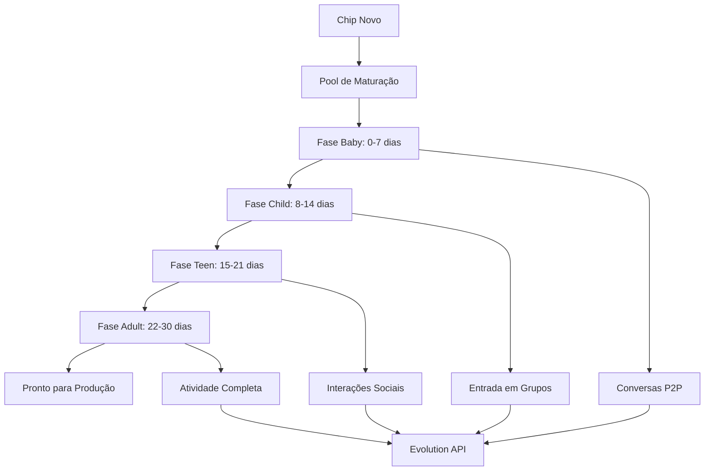

# 🎯 GUIA COMPLETO - SISTEMA DE MATURAÇÃO DE CHIPS

## 📋 ÍNDICE

1. [Visão Geral](#-visão-geral)
2. [Como Funciona](#-como-funciona)
3. [Pools de Maturação](#-pools-de-maturação)
4. [Estratégias Disponíveis](#-estratégias-disponíveis)
5. [API Endpoints](#-api-endpoints)
6. [Scripts de Gerenciamento](#-scripts-de-gerenciamento)
7. [Monitoramento](#-monitoramento)
8. [Casos de Uso](#-casos-de-uso)
9. [Troubleshooting](#-troubleshooting)

---

## 🎯 VISÃO GERAL

O **Sistema de Maturação de Chips** do OracleWA é uma solução inovadora para preparar chips WhatsApp de forma completamente automatizada, segura e com **CUSTO ZERO**. 

### ✨ Principais Características

- **🔄 Conversas P2P Automáticas**: Chips conversam entre si naturalmente
- **👥 Entrada Automática em Grupos**: Participação inteligente em grupos públicos
- **🎭 Scripts de Conversação**: Diálogos pré-programados em português brasileiro
- **🏊‍♂️ Pools Organizados**: Separação entre chips da OracleWA e clientes
- **🎯 Estratégias Flexíveis**: Múltiplas abordagens de maturação
- **📊 Monitoramento Real-time**: Dashboard completo de acompanhamento
- **🔄 Transição Automática**: Chips prontos movidos para produção automaticamente

### 💰 CUSTO ZERO

- ✅ Sem APIs pagas (OpenAI, etc.)
- ✅ Conversas entre próprios chips
- ✅ Grupos públicos gratuitos
- ✅ Scripts pré-programados
- ✅ Infraestrutura própria

---

## 🔄 COMO FUNCIONA

### **Fluxo de Maturação**



### **Processo Detalhado**

1. **📱 Adição ao Pool**
   - Chip é adicionado via API ou script
   - Estratégia de maturação é definida
   - Processo inicia automaticamente

2. **💬 Conversas P2P**
   - Sistema encontra outros chips disponíveis
   - Agenda conversas naturais entre eles
   - Simula digitação e reações humanas

3. **👥 Entrada em Grupos**
   - Seleciona grupos públicos seguros
   - Agenda entrada com delays naturais
   - Inicia interações moderadas

4. **📈 Evolução Gradual**
   - Aumenta atividade progressivamente
   - Monitora saúde e riscos
   - Ajusta comportamento conforme necessário

5. **🚀 Produção Ready**
   - Chip atinge critérios de maturação
   - É movido para pool de produção
   - Fica disponível para clientes

---

## 🏊‍♂️ POOLS DE MATURAÇÃO

### **Pool OracleWA (Contingência)**

**Propósito**: Chips de reserva da própria OracleWA
- ✅ Disponíveis para venda/aluguel
- ✅ Backup para situações críticas
- ✅ Testes de novas estratégias
- ✅ Demonstrações para clientes

**Configuração**:
```json
{
  "maxSize": 100,
  "minActive": 10,
  "targetMaturity": 30,
  "reserveRatio": 0.3
}
```

### **Pools de Clientes**

**Propósito**: Chips específicos de cada cliente
- ✅ Isolamento total entre clientes
- ✅ Configurações personalizadas
- ✅ Controle individual de limites
- ✅ Métricas separadas

**Exemplo - Cliente "loja_abc"**:
```json
{
  "maxSize": 20,
  "targetMaturity": 30,
  "customSettings": {
    "antibanStrategy": "conservative",
    "groupsAllowed": true,
    "voiceNotesEnabled": false
  }
}
```

---

## 🎯 ESTRATÉGIAS DISPONÍVEIS

### **1. Gradual Conti Chips (Padrão)**
- **Duração**: 30 dias
- **Segurança**: Alta
- **Descrição**: Baseada nas práticas da Conti Chips

```javascript
// Fases da estratégia
Baby (0-7):    5 msgs/dia, 0 grupos
Child (8-14):  15 msgs/dia, 1 grupo
Teen (15-21):  30 msgs/dia, 2 grupos
Adult (22-30): 50 msgs/dia, 3 grupos
```

### **2. Maturação Rápida**
- **Duração**: 14 dias
- **Segurança**: Média
- **Descrição**: Para situações urgentes

### **3. Lenta e Segura**
- **Duração**: 45 dias
- **Segurança**: Máxima
- **Descrição**: Ultra-conservadora

### **4. Híbrido Social**
- **Duração**: 25 dias
- **Segurança**: Alta
- **Descrição**: Foco em interações sociais

### **5. Contingência OracleWA**
- **Duração**: 35 dias
- **Segurança**: Alta
- **Descrição**: Especializada para pool próprio

---

## 🛠️ API ENDPOINTS

### **Gestão de Chips**

```bash
# Adicionar chip ao pool
POST /api/chip-maturation/chips
{
  "instanceName": "chip-001",
  "phoneNumber": "5511999999999",
  "owner": "oraclewa",
  "strategy": "gradual_conti_chips",
  "priority": "normal"
}

# Listar todos os chips
GET /api/chip-maturation/chips

# Detalhes de um chip
GET /api/chip-maturation/chips/{chipId}

# Alterar estratégia
PUT /api/chip-maturation/chips/{chipId}/strategy
{
  "strategy": "fast_maturation"
}

# Mover para produção
POST /api/chip-maturation/chips/{chipId}/production
{
  "targetClient": "cliente_abc"
}
```

### **Estatísticas**

```bash
# Estatísticas gerais
GET /api/chip-maturation/stats

# Pool Oracle
GET /api/chip-maturation/pools/oracle

# Pools de clientes
GET /api/chip-maturation/pools/clients

# Chips prontos
GET /api/chip-maturation/pools/production-ready
```

### **Conversas e Grupos**

```bash
# Agendar conversa
POST /api/chip-maturation/conversations/schedule
{
  "from": "chip-001",
  "to": "chip-002",
  "messageCount": 10,
  "conversationType": "casual_chat"
}

# Agendar entrada em grupo
POST /api/chip-maturation/groups/join
{
  "instanceName": "chip-001",
  "category": "technology"
}
```

### **Estratégias**

```bash
# Listar estratégias
GET /api/chip-maturation/strategies

# Recomendar estratégia
POST /api/chip-maturation/strategies/recommend
{
  "urgency": "normal",
  "riskTolerance": "medium",
  "owner": "oraclewa"
}
```

---

## 🔧 SCRIPTS DE GERENCIAMENTO

### **Adicionar Chips ao Pool**

```bash
# Interativo
node scripts/chip-maturation/add-chips-to-pool.js

# Lote
node scripts/chip-maturation/add-chips-to-pool.js --batch 10 --owner oraclewa

# Com estratégia específica
node scripts/chip-maturation/add-chips-to-pool.js --strategy fast_maturation
```

### **Monitor em Tempo Real**

```bash
# Dashboard contínuo
node scripts/chip-maturation/monitor-maturation.js

# Snapshot único
node scripts/chip-maturation/monitor-maturation.js --snapshot
```

---

## 📊 MONITORAMENTO

### **Dashboard Tempo Real**

O dashboard mostra:

- 📊 **Estatísticas Gerais**: Total por pool, fases, etc.
- 💬 **Atividade Conversas**: Mensagens, tipos, agendamentos
- 👥 **Atividade Grupos**: Memberships, interações pendentes
- 🚀 **Chips Prontos**: Lista de chips preparados para produção
- 🌱 **Progresso**: Barras de progresso por chip
- 🚨 **Alertas**: Problemas e avisos importantes

### **Métricas Monitoradas**

```javascript
// Por chip
{
  healthScore: 85,        // 0-100
  riskLevel: 'low',       // low, medium, high
  maturationProgress: 67, // 0-100%
  totalMessages: 156,
  conversationsStarted: 12,
  groupsJoined: 3
}

// Por pool
{
  total: 25,
  active: 23,
  maturing: 20,
  ready: 3,
  distribution: {
    baby: 5,
    child: 8,
    teen: 4,
    adult: 3
  }
}
```

---

## 💼 CASOS DE USO

### **1. Pool de Contingência OracleWA**

**Cenário**: Manter sempre 10+ chips aquecidos em standby

```bash
# Adicionar 15 chips ao pool Oracle
node add-chips-to-pool.js --batch 15 --owner oraclewa --strategy oracle_contingency

# Monitorar progresso
node monitor-maturation.js
```

### **2. Preparação para Novo Cliente**

**Cenário**: Cliente "loja_nova" precisa de 5 chips em 2 semanas

```bash
# Estratégia rápida para urgência
curl -X POST http://localhost:3000/api/chip-maturation/chips \
  -H "Content-Type: application/json" \
  -d '{
    "instanceName": "loja_nova_chip_1",
    "owner": "loja_nova",
    "strategy": "fast_maturation",
    "priority": "high"
  }'
```

### **3. Teste de Nova Estratégia**

**Cenário**: Testar estratégia híbrida social

```bash
# Criar grupos de teste
for i in {1..5}; do
  curl -X POST http://localhost:3000/api/chip-maturation/chips \
    -H "Content-Type: application/json" \
    -d '{
      "instanceName": "test_social_'$i'",
      "owner": "oraclewa",
      "strategy": "social_hybrid"
    }'
done
```

### **4. Substituição de Chip Bloqueado**

**Cenário**: Chip em produção foi bloqueado, precisa de substituto

```bash
# Buscar chip pronto
curl http://localhost:3000/api/chip-maturation/pools/production-ready?pool=oraclewa

# Mover para produção
curl -X POST http://localhost:3000/api/chip-maturation/chips/chip-123/production \
  -H "Content-Type: application/json" \
  -d '{"targetClient": "cliente_urgente"}'
```

---

## 🆘 TROUBLESHOOTING

### **Problemas Comuns**

#### **1. Chip não está progredindo**

**Sintomas**:
- Chip há dias na mesma fase
- Poucas conversas registradas
- Health score baixo

**Soluções**:
```bash
# Verificar detalhes do chip
curl http://localhost:3000/api/chip-maturation/chips/chip-problematico

# Alterar estratégia
curl -X PUT http://localhost:3000/api/chip-maturation/chips/chip-problematico/strategy \
  -H "Content-Type: application/json" \
  -d '{"strategy": "slow_safe"}'

# Forçar novas conversas
curl -X POST http://localhost:3000/api/chip-maturation/conversations/schedule \
  -H "Content-Type: application/json" \
  -d '{
    "from": "chip-problematico",
    "to": "chip-helper",
    "messageCount": 5,
    "conversationType": "casual_chat"
  }'
```

#### **2. Muitos chips em uma fase**

**Sintomas**:
- Distribuição desbalanceada
- Pool Oracle com muitos "baby"
- Poucos chips prontos

**Soluções**:
- Ajustar estratégias para acelerar
- Adicionar mais chips com estratégias rápidas
- Verificar se Evolution API está respondendo

#### **3. Nenhum chip chegando à produção**

**Sintomas**:
- 0 chips prontos há dias
- Todos param em fases intermediárias
- Critérios muito rígidos

**Soluções**:
```bash
# Verificar critérios de produção
# Editar: /modules/chip-maturation/core/chip-maturation-pool.js
# Método: isChipReady()

# Reduzir temporariamente os critérios
const criteria = {
  minDays: 20,      // era 30
  minMessages: 300, // era 500
  minConversations: 10, // era 20
  minGroups: 2      // era 3
};
```

### **Logs e Debug**

```bash
# Ver logs detalhados
tail -f logs/api/combined.log | grep "chip-maturation"

# Debug de conversas
curl -X POST http://localhost:3000/api/debug/conversation \
  -H "Content-Type: application/json" \
  -d '{"chipId": "chip-debug", "simulate": true}'

# Verificar saúde geral
curl http://localhost:3000/health | jq '.features.chipMaturationModule'
```

---

## 🚀 PRÓXIMOS PASSOS

### **Para Implementar**

1. **📱 Conectar com Evolution API Real**
   - Integrar envio de mensagens reais
   - Implementar status "typing"
   - Conectar entrada em grupos

2. **🤖 IA para Conversas (Futuro)**
   - Integrar Ollama local (gratuito)
   - Conversas mais inteligentes
   - Resposta a mensagens privadas

3. **📊 Dashboard Web**
   - Interface gráfica rica
   - Controles visuais
   - Relatórios exportáveis

4. **🔔 Sistema de Alertas**
   - Notificações por email/WhatsApp
   - Alertas de problemas críticos
   - Relatórios automáticos

### **Melhorias Contínuas**

- Novas estratégias baseadas em resultados
- Otimização de performance
- Integração com outros módulos
- Expansão para Telegram/Instagram

---

## 📞 SUPORTE

**Para dúvidas ou problemas**:
- 📧 Consulte logs do sistema
- 🔍 Use endpoints de debug
- 📊 Monitore métricas em tempo real
- 🛠️ Execute scripts de diagnóstico

**Este sistema foi projetado para ser robusto, escalável e completamente automatizado. Uma vez configurado, funciona de forma autônoma, preparando chips continuamente para suas operações.**

---

*🎯 Sistema desenvolvido para o OracleWA SaaS v3.0*
*🔄 Maturação automática de chips com custo zero*
*🚀 Preparação para produção em escala industrial*